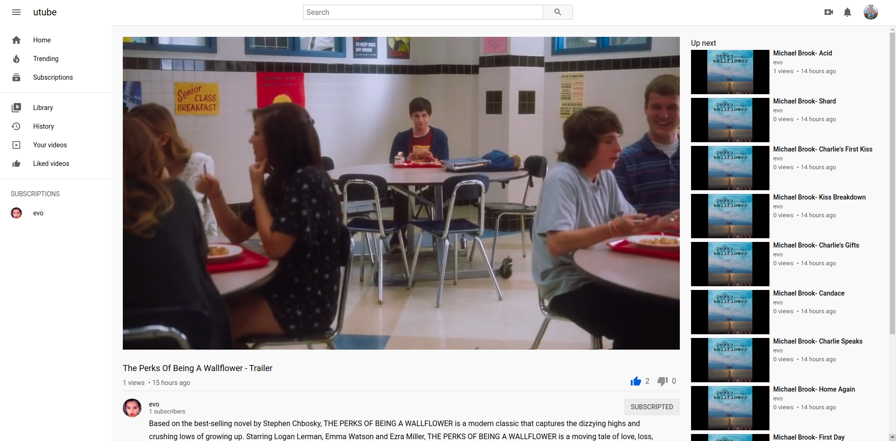

# utube - YouTube Clone

This project built with React + Redux + firebase.

**Check out the [deployed site](https://keen-albattani-117136.netlify.app/)**

## Features

- Sign in / Sign Up ( Email or google authentication)
- Video
  - Upload 
  - Watch 
  - Increase Views
  - Like and dislike video
  - Download 
  - Comment  
- Subscribe to a channel
- View liked videos
- Trending
- Subscriptions
- History
- Channel
  - Modify channel name and description
  - Upload channel banner
  - Upload channel avatar


## Core packages

1.  State Management - react-redux
2.  Routing - react-route-dom
3.  Styling - styled-components
4.  Database - firebase  
5.  Video Player - react-player
6.  Network - axios


## Project setup

### Firebase 
Create your firebase project. Get the project config, place it on **src/firbase/config.js**.
Enable Sign-in method: Email and Google on project **Authentication** tag.

### Cloudinary

I am using [cloudinary](https://cloudinary.com/) to store uploaded videos.


At the root of your project create an .env file with the following contents:

```
REACT_APP_CLOUDINARY_ENDPOINT=<YOUR_CLOUDINARY_UPLOAD_URL> 

REACT_APP_FIREBASE_APIKEY=<YOUR_FIREBASE_API_KEY>
```

### Install packages

```
npm install
```

### Compiles and hot-reloads for development

```
npm start
```

### Compiles and minifies for production

```
npm run build
```


## Screenshots

### Home Page (/)


### Library page (/feed/library)


### Watch Page (/watch/:videoId)





### Channel Page (/channel/:channelId)


### Upload Video Modal


### Edit Channel


## License

This project is licensed under the MIT License
